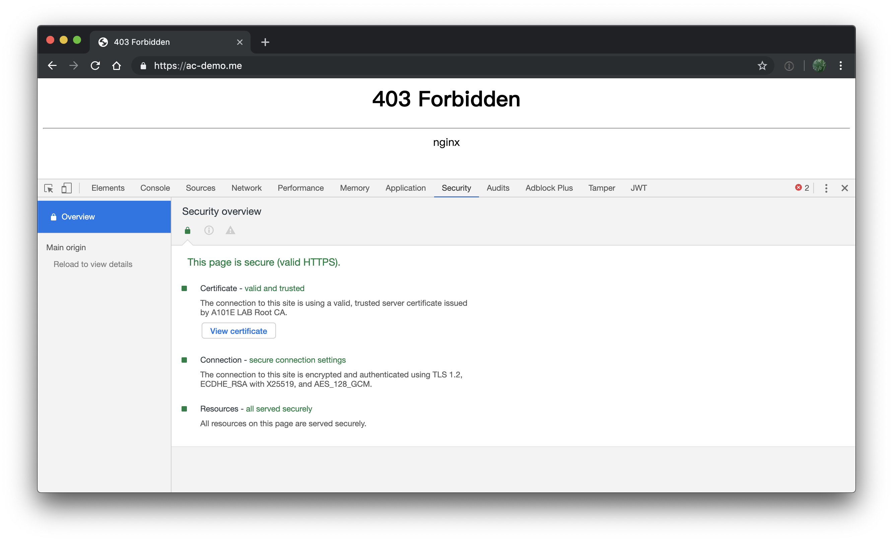

# 自签发一个包含完整证书链的网站服务器证书

## 快速上手

当前目录下的相关脚本展示了如何自签发一个包含完整证书链的网站服务器证书的方法，测试环境为 `LibreSSL 2.6.5 on macOS` 。

在本地开发测试时，可以通过修改 [hosts](https://www.howtogeek.com/howto/27350/beginner-geek-how-to-edit-your-hosts-file/) 文件来添加任何你喜欢的域名并将其解析到 `127.0.0.1` 。以下例子里使用的自定义域名是 `ac-demo.me` ，对应 `hosts` 文件里需要添加以下内容：

```ini
127.0.0.1 ac-demo.me
```

第一次运行本目录中脚本时，按照顺序执行以下脚本即可。

**注意脚本执行过程中的交互式输入提示信息，仔细阅读后正确填写。**

```bash
# 创建自签名的根 CA 证书对
bash 0_create_the_root_pair.sh

# 使用根 CA 证书给新创建的中级 CA 证书对签名
bash 1_create_the_intermediate_pair.sh

# 使用中级 CA 证书对域名为 ac-demo.me 的网站服务器证书签名
bash 2_sign_server_and_client_certs.sh ac-demo.me

# 移除网站服务器证书私钥的口令保护以支持服务器的自动重启时无需交互式输入私钥口令
# 该脚本生成的是可以用于 nginx 服务器的证书对
bash 3_create_nginx_certs.sh ac-demo.me

# 生成域名为 ac-demo.me 的 HTTPS 站点证书测试容器用 docker-compose.yml
bash 4_build_docker-compose.sh ac-demo.me

# 启动本地可访问的测试 https 站点，测试新部署的证书
docker-compose up -d

# 在已有根 CA 证书对和中级 CA 证书对时
# 从 2_sign_server_and_client_certs.sh 脚本开始顺序执行即可签发不同域名的网站服务器证书

```

## 最终效果展示 

 

> 需要「添加自签发的 SSL 证书为受信任的根证书」才能在浏览器中看到以上效果。

## 参考文献

* [OpenSSL Certificate Authority by Jamie Nguyen](https://jamielinux.com/docs/openssl-certificate-authority/)
* [Getting Chrome to accept self-signed localhost certificate](https://stackoverflow.com/questions/7580508/getting-chrome-to-accept-self-signed-localhost-certificate/43666288#43666288)


